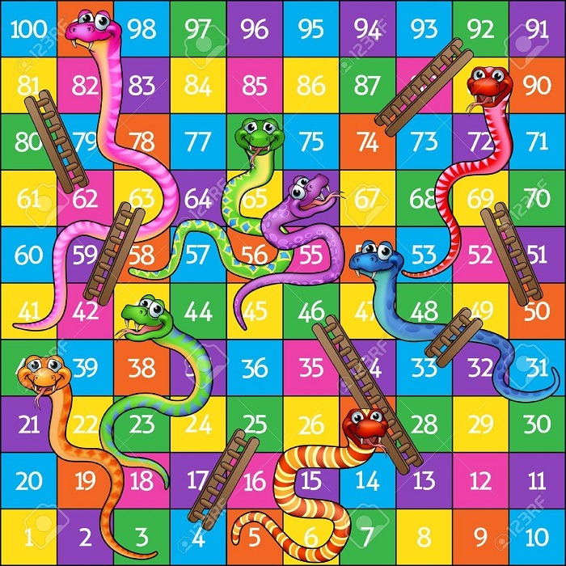

Snake and Ladder — Java Swing Game

A 2-player Snake and Ladder game built with **Java Swing/AWT** as a learning project. Roll the dice, climb ladders, avoid snakes, and race to square 100!


## 🎮 Features

- Classic 2-player Snake and Ladder gameplay
- Custom dice-roll animation with image-based dice faces
- Player name input before starting the game
- Player token images that move across the board
- Simple, colorful custom-drawn GUI (no external game engine — pure Java 2D graphics)
- Reset and About buttons for game controls

## 🛠️ Built With

- **Java** (JDK 8+)
- **Swing** (`JFrame`, `JPanel`, `JButton`, `JTextField`) for the UI
- **AWT** (`Graphics`, `Image`, `ImageIcon`) for custom rendering and animation

## 📂 Project Structure
snake_ladder/
├── Demo3.java # Main game (GUI, dice roll, player movement)
├── Demo6.java # Early prototype (board number animation)
├── *.jpeg, *.gif # Game assets (board, dice faces, player tokens, buttons)
└── README.md


## 🚀 How to Run

**Prerequisites:** [JDK 8 or above](https://www.oracle.com/java/technologies/downloads/) installed and on your PATH.

1. Clone the repository
```bash
   git clone https://github.com/rasalshivang73-cpu/Java-snakeladder_game.git
   cd Java-snakeladder_game
```

2. Compile the game
```bash
   javac Demo3.java
```

3. Run it
```bash
   java Demo3
```

> Make sure you run the `java` command from the same folder as the image assets (`.jpeg`/`.gif` files) — the game loads them using relative paths.

## 📸 Preview

The board layout used in this game:



## 🎯 How to Play

1. Enter names for Player 1 and Player 2 in the text fields
2. Click **Roll** to roll the dice
3. Your token moves forward based on the dice value
4. Landing on a ladder takes you up, landing on a snake sends you down
5. First player to reach square 100 wins!

## 📖 About This Project

This project was built while learning core Java concepts — OOP, event handling (`ActionListener`), and 2D graphics with AWT/Swing. It's a beginner-friendly example of building a simple interactive desktop game without any external libraries or game engines.

## 🔮 Possible Improvements

- [ ] Add win/game-over detection with a popup
- [ ] Add proper snake and ladder position logic (currently the board is visual only)
- [ ] Support more than 2 players
- [ ] Add sound effects for dice rolls
- [ ] Migrate from absolute pixel positioning (`setBounds`) to a responsive layout

## 📝 License

This project is open source and available for learning purposes.

